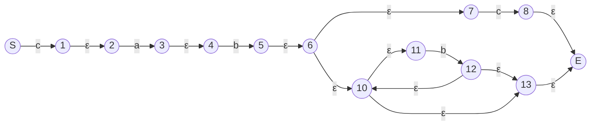

# RLex

## 运算符定义

| 符号 | 解释 |
| ---- | ---- |
| （   |      |
| ｜   |      |
| *    |      |
| ）   |      |

## Mermaid

```regex
(c(abc|b*))
```

上述样例结果如下


```mermaid
graph LR
0((S))
1((1))
2((2))
3((3))
4((4))
5((5))
6((6))
7((7))
8((8))
9((E))
10((10))
11((11))
12((12))
13((13))

8--ε-->9
7--c-->8
6--ε-->7
12--ε-->10
13--ε-->9
12--ε-->13
11--b-->12
10--ε-->11
10--ε-->13
6--ε-->10
5--ε-->6
4--b-->5
3--ε-->4
2--a-->3
1--ε-->2
0--c-->1
```

