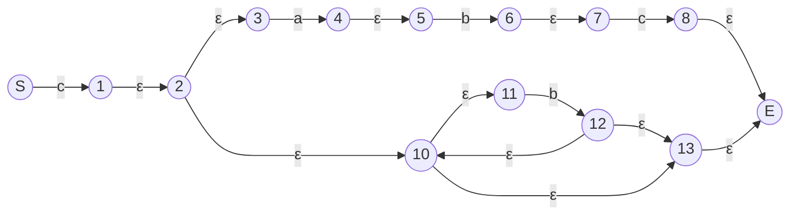
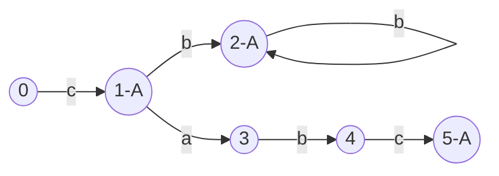
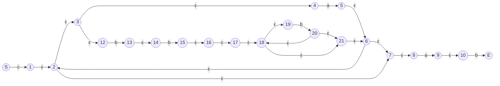
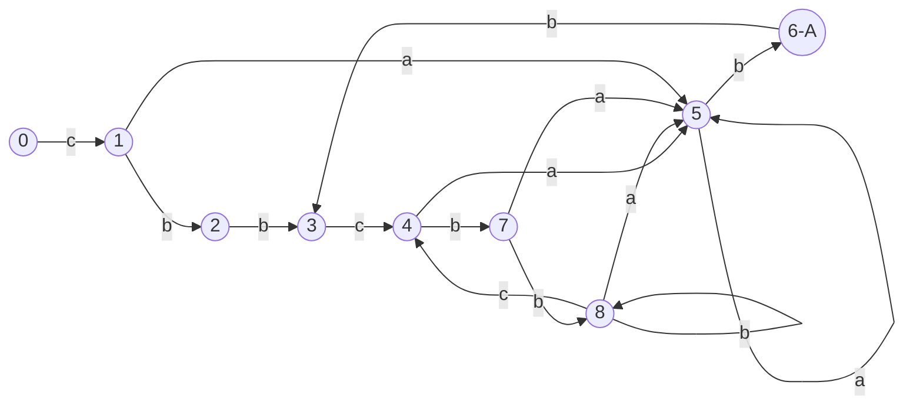

# RLex

## 运算符定义

| 符号 | 解释 |
| ---- | ---- |
| （   |      |
| *    |      |
| ｜   |      |
| -   |      |
| ）   |      |

## Mermaid

```regex
(c(abc|b*))
```

上述样例结果如下



转换DFA如下：



```regex
c(a|bbcb*)*(ab)
```

上述样例结果如下


DFA如下


# Getting Start
```bash
Usage: rlex <config_file> <output_file>
```
the sample of sample_ouput.rs:
```rust
%{
    // your struct here
    pub struct Foo {
        x: i32,
        y: i32,
    }

    pub struct Bar {
        x: i32,
        y: i32,
    }
%}
    // your regex definitions here
    number = "[0-9]*"
    idenfitier = "[A-Za-z][A-Za-z0-9]*"
    error = "( |;|?|,|!|=)*"
    test = "\*|\\|\||\."
%%
    // your rules here
    {number} -> |s|{
        println!("number: {}", s);
    } ;;
    {idenfitier} -> |s|{
        println!("idenfitier: {}", s);
    } ;;
    {error} -> |s|{
        println!("error: {}", s);
    } ;;
    ({test})* -> |s|{
        println!("test: {}", s);
    } ;;
%%
    // your variable here
    pub a: i32,
    pub b: i64, 
```

```bash
rlex sample.rlex sample_ouput.rs                                         
Done.
Please add the following dependencies to your Cargo.toml:
serde = { version = "1.0", features = ["derive"] }
serde_json = "1.0"
```

Then copy sample_ouput.rs to your own project, add the following dependencies to your Cargo.toml.
```toml
serde = { version = "1.0", features = ["derive"] }
serde_json = "1.0"
```

```rust
fn main() {
    let r = rlex_gen::rlex::Rlex { a: 1, b: 2 };
    r.lex("int abc_123 = 123; if (abc_123 == 123) { abc_123 = 456; }");
}
```
Run, then the output is:

```bash
idenfitier: int
error:  
idenfitier: abc
unknown error:_
number: 123
error:  = 
number: 123
error: ; 
idenfitier: if
error:  
unknown error:(
idenfitier: abc
unknown error:_
number: 123
error:  == 
number: 123
unknown error:)
error:  
unknown error:{
error:  
idenfitier: abc
unknown error:_
number: 123
error:  = 
number: 456
error: ; 
unknown error:}
```
